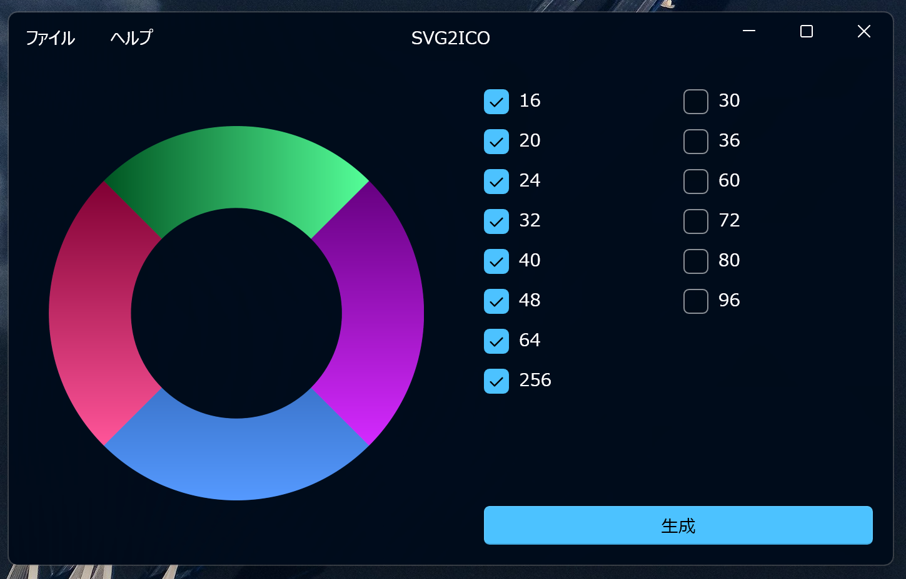

# SVG2ICO
SVG2ICO is the software that convert to ICO from SVG Image.



## Install the package
1. Extract `SVG2ICO`

2. If your computer had installed [PotableInstaller](https://github.com/Himeyama/Installer), click on PotableInstaller.lnk.
   otherwise move to the next step (3.).

3. Run `onlineInstall.ps1` with PowerShell
	if cannot install the software, try running the below command.

    ```ps1
    Set-ExecutionPolicy RemoteSigned
    ```
    
## Create a package
```ps1
./createPackage
```

## License
The License of the software is MIT License.

## Dependency
This software depends on SVG.NET that license is Ms-PL.
