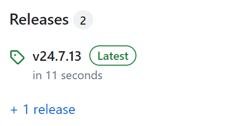
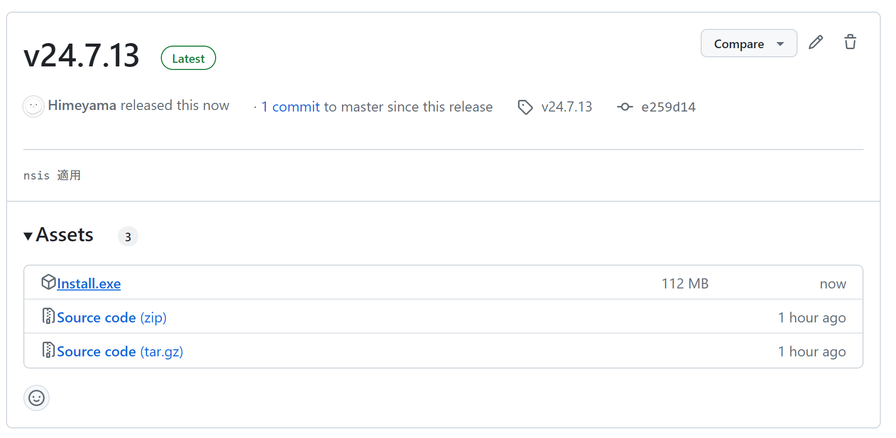
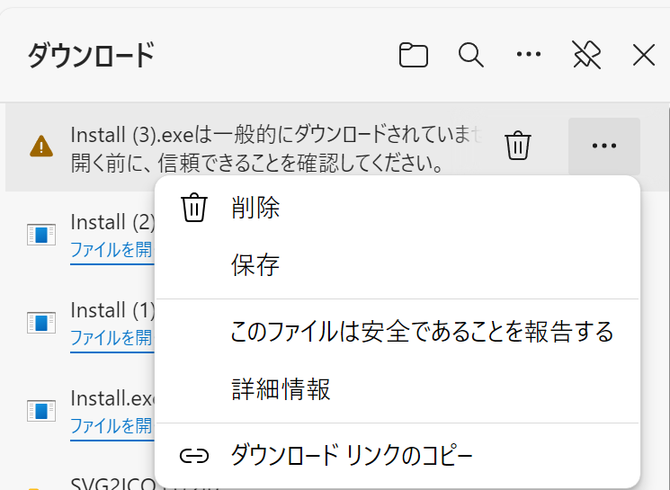
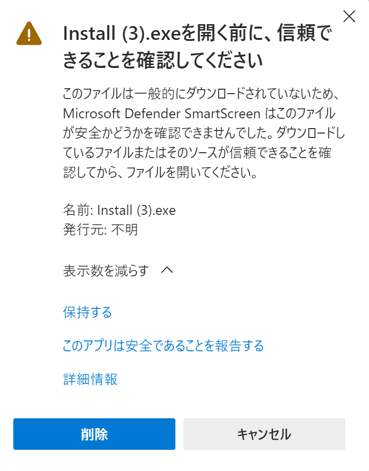

# SVG2ICO
SVG2ICOは、SVG画像をICOに変換するソフトウェアです。

<image width="600" src="https://github.com/Himeyama/Svgicon5/assets/39254183/c11780e5-4239-4922-9765-f044516289b0" />

## インストール方法

1. Releases に移動します



2. Install.exe をクリックしてダウンロードします



3. 警告が出る場合は、メニューから保存をクリックします



4. 再度警告が出る場合は、「詳細設定」をクリックし「保持する」をクリックします



    
## 開発ツール

### 実行
```ps1
./dev run
```

### インストール
```ps1
./dev install
```

### アンインストール
```ps1
./dev uninstall
```

### zip を生成
```ps1
./dev pack
```
